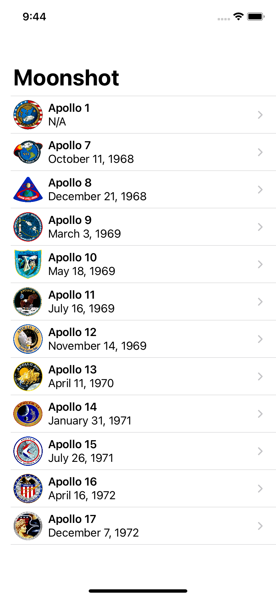

## Day 40: Project 8 - Part 2

**Current Status:**  Done ✅

*https://www.hackingwithswift.com/100/swiftui/40*

> Today we’re going to be working through the first part of our application, and in particular we’re going to be getting our data right. I realize that data isn’t terribly exciting, but as your skills grow you’ll start to see how data really defines what your app can do – no matter what fancy designs you add, or what slick animations you introduce, if your data isn’t right your app just won’t work.
>
>Along the way you’re going to meet an important Swift feature called generics. This is a feature I definitely class as well outside of beginner Swift, but as you’ll see generics let us create highly reusable code with only a little extra thinking.
>
>Reusable code is important, because it helps us accomplish bigger and better results with less work. However, as Ralph Johnson once said, “before software can be reusable it first has to be usable” – as nice as generics are, we’ll only start using them once we’ve solved the problem the easier way first.

## What I've learned on this day:
- Loading a specific kind of Codable data
- Using generics to load any kind of codable data
- Formatting our mission view

## Screenshots

