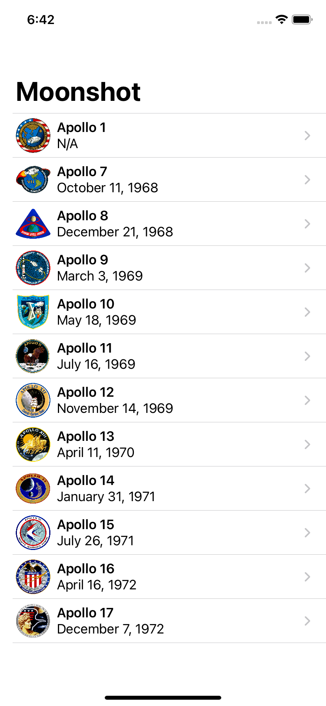
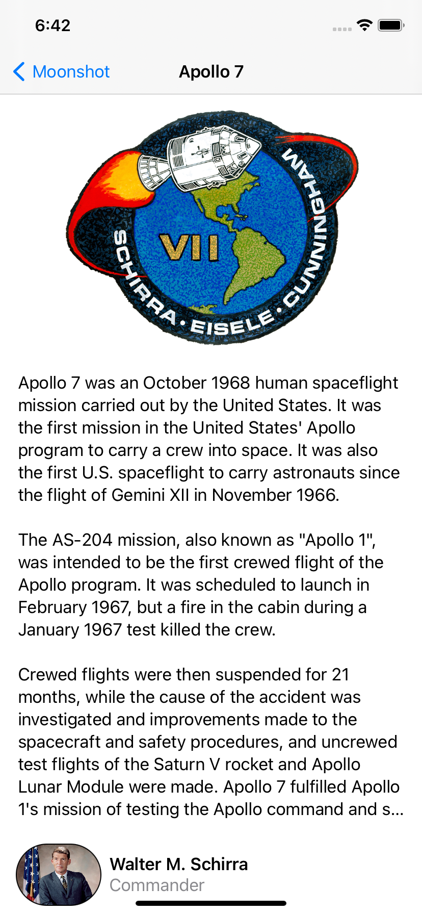
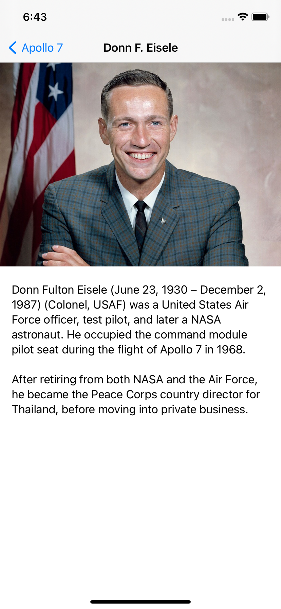

## Day 41: Project 8 - Part 3

**Current Status:**  Done ✅

*https://www.hackingwithswift.com/100/swiftui/41*

>Today we’re going to be completing our Moonshot app by adding two more views plus navigation between them, but here is where you’ll start to see what it takes to create custom layouts in SwiftUI – we’ll be using GeometryReader to get the view size, layoutPriority() to help guide SwiftUI’s layout engine, and more.
>
>Along the way, we’re also going to be tackling one of the common problems you’ll face as programmer: when you have two pieces of separate data that need to be merged somehow. For us, that’s our astronaut and mission data, but the concept is transferrable enough as you’ll see.
>
>At one point in today’s topics I encourage you to stop and play around with the design. I’m sure some folks will skip over this wanting to rush towards the end, but I hope you don’t. As the astronaut John Glenn said, “I suppose the quality in an astronaut more powerful than any other is curiosity – they have to get to some place nobody’s ever been.”
>
>Be curious – take the time to explore your skills and it will pay off!
>
>Today you have three topics to work through, in which you’ll work with GeometryReader, ScrollView, layoutPriority(), and more.

## What I've learned on this day:
- Showing mission details with ScrollView and GeometryReader
- Merging Codable structs using first(where:)
- Fixing problems with buttonStyle() and layoutPriority()

## Screenshots

