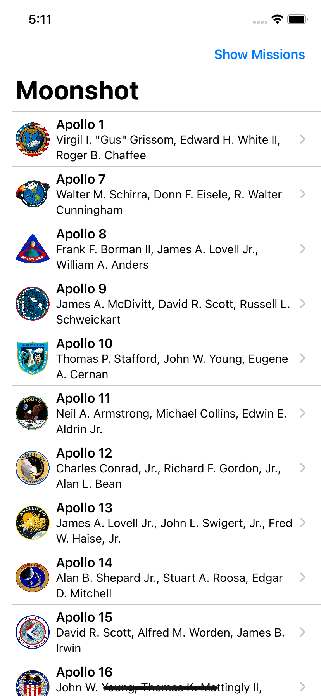
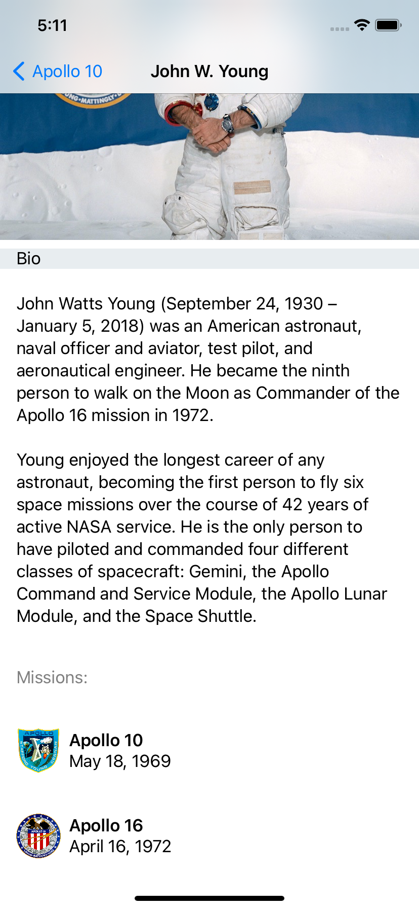
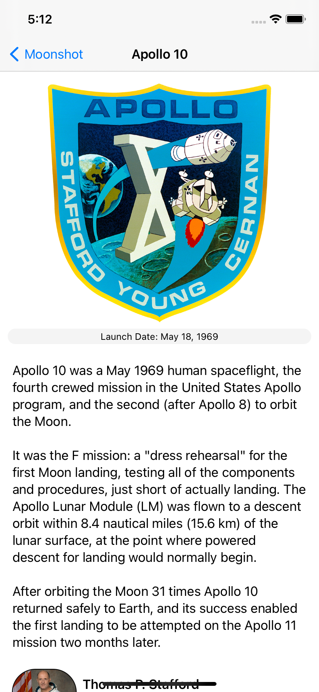

## Day 42: Project 8 - Part 4 (WRAP UP)

**Current Status:**  Done ✅

*https://www.hackingwithswift.com/100/swiftui/42*

>You’ve now finished Moonshot, which is the first of our projects that started to get difficult – it took longer to explain, we used custom SwiftUI layouts, and I even snuck in a few advanced Swift features. Not all our future projects are going to be difficult, but it’s certainly going to be the case that they are more complex; there is more to them, which means the resulting apps are more interesting, and also more representative of real-world app building.
>
>As the complexity rises so do the odds of making mistakes, and Swift is pretty unforgiving here – as you will undoubtedly have seen by now, even one small mistake on line 20 can result in a random error appearing on line 5, and this can be disheartening.
>
>Well, I hope today’s quote will inspire you. I’ve chosen it specially for today for reasons best left to the reader, but it’s this: don’t panic! These sorts of problems are common, and the easiest way to solve them right now is to comment out whatever code you most recently added, and keep doing so until your code works. You can then slowly re-introduce code until you find the part that causes your compile to break, then fix it.

## Challenge:
- Add the launch date to MissionView, below the mission badge.
- Modify AstronautView to show all the missions this astronaut flew on.
- Make a bar button in ContentView that toggles between showing launch dates and showing crew names.

## Screenshots

