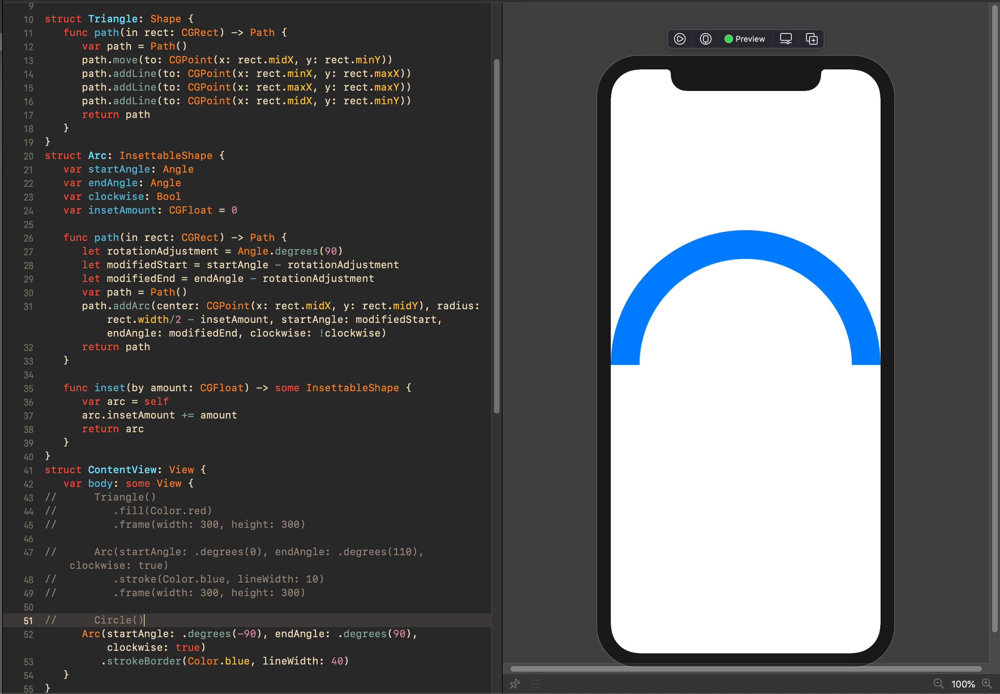

## Day 43: Project 8 - Part 1

**Current Status:**  Done ✅

*https://www.hackingwithswift.com/100/swiftui/43*

>Today kicks off another new technique project where we’ll be focusing on drawing. This is an area of SwiftUI you might think you won’t need much, but nothing could be further from the truth: SwiftUI makes high-performance drawing so easy, so accessible to everyone, that you’ll find places you can use your skills in almost every app you build.
>
>Another thing that drawing is good for – and this will become more apparent in parts two and three of this project – is help create a sense of playfulness. As you work your way through these next few days you’ll find you can create beautiful designs in only a handful of lines of code, and I lost countless hours while preparing my examples just playing around and having fun.
>
>Don’t take my word for it – renowned Dutch impressionist Vincent Van Gogh said, “I sometimes think there is nothing so delightful as drawing.”

## What I've learned on this day:
- Creating custom paths with SwiftUI
- Paths vs shapes in SwiftUI
- Adding strokeBorder() support with InsettableShape

## Screenshots

