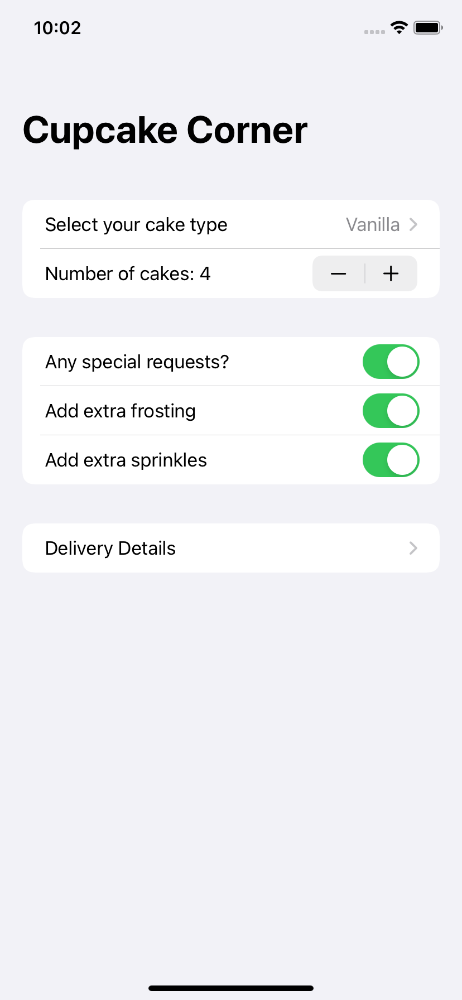
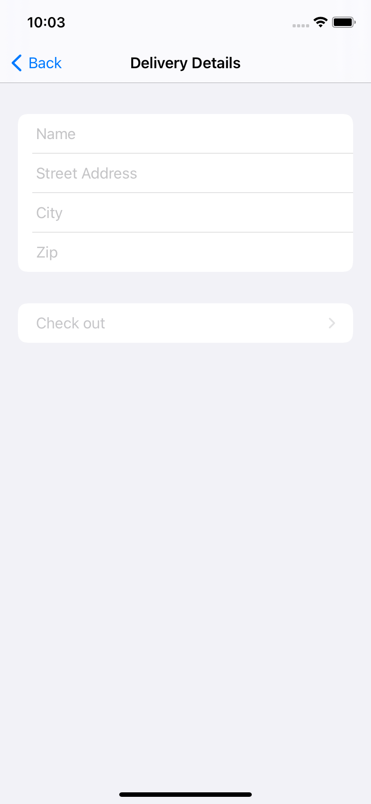

## Day 50: Project 10 - Part 2

**Current Status:**  Done ✅

*https://www.hackingwithswift.com/100/swiftui/50*

>Today we’re going to be building the user interface for our app – everything apart from the part where we handle the networking.
>
>Although the fundamentals of today’s work will be familiar to you, there’s still scope for new things as you’ll see. This will become particularly common as we continue to push SwiftUI’s boundaries – everything is easy when your app is easy, but as we venture more into larger apps you’ll find we need to spend more time getting the details right.
>
>But that’s OK. As American tire magnate Harvey Firestone once said, “success is the sum of details.” I hope you can look at Apple’s iOS apps and be inspired by them: their UI is often uncomplicated, but they put a ton of work into getting the details right so the whole experience feels great.
>
>When the user launches your app on their $1000 iPhone, it takes up the full screen. You owe it to them, and to yourself, to make sure you’ve done your best to get things working as smoothly as possible. If Apple can do it, so can we!

##Screenshots:

