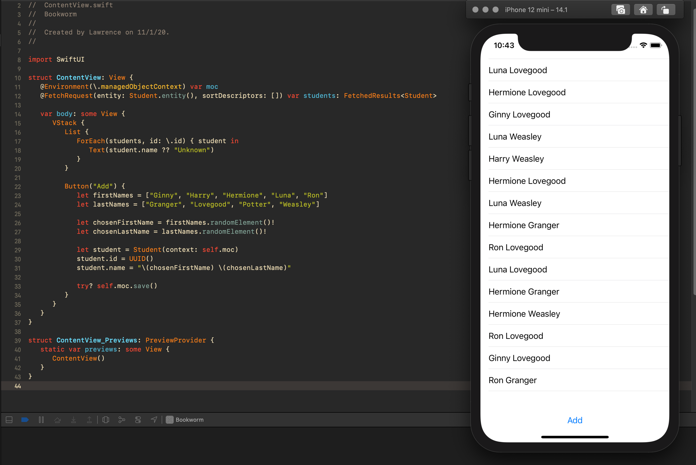

## Day 53: Project 11 - Part 1

**Current Status:**  Done ✅

*https://www.hackingwithswift.com/100/swiftui/53*

>Today we’re starting another new project, and this is where things really start to get serious because you’ll be learning one important new Swift skill, one important new SwiftUI skill, and one important app development skill, all of which will come in useful as build the project.
>
>The app development skill you’ll be learning is one of Apple’s frameworks: Core Data. It’s responsible for managing objects in a database, including reading, writing, filtering, sorting, and more, and it’s hugely important in all app development for iOS, macOS, and beyond.
>
>Canadian software developer Rob Pike – creator of the Go programming language, member of the team that developed Unix, co-creator of UTF-8, and also published author – wrote this about data:
>
>“Data dominates. If you've chosen the right data structures and organized things well, the algorithms will almost always be self-evident. Data structures, not algorithms, are central to programming.”
>
>This is often shortened to “write stupid code that uses smart objects,” and as you’ll see objects don’t get much smarter than when they are backed by Core Data!e data struct inside it, and should make supporting Codable on the struct much easier.

## What I have learned on this day:
- Creating a custom component with @Binding
- Using size classes with AnyView type erasure
- How to combine Core Data and SwiftUI

##Screenshots:

